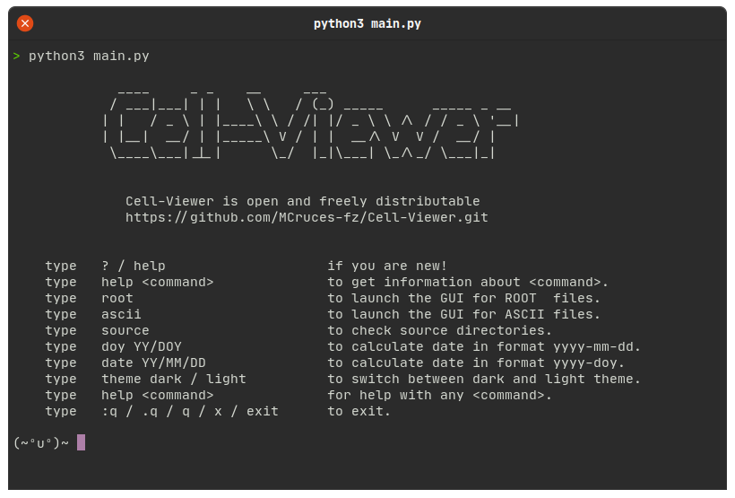
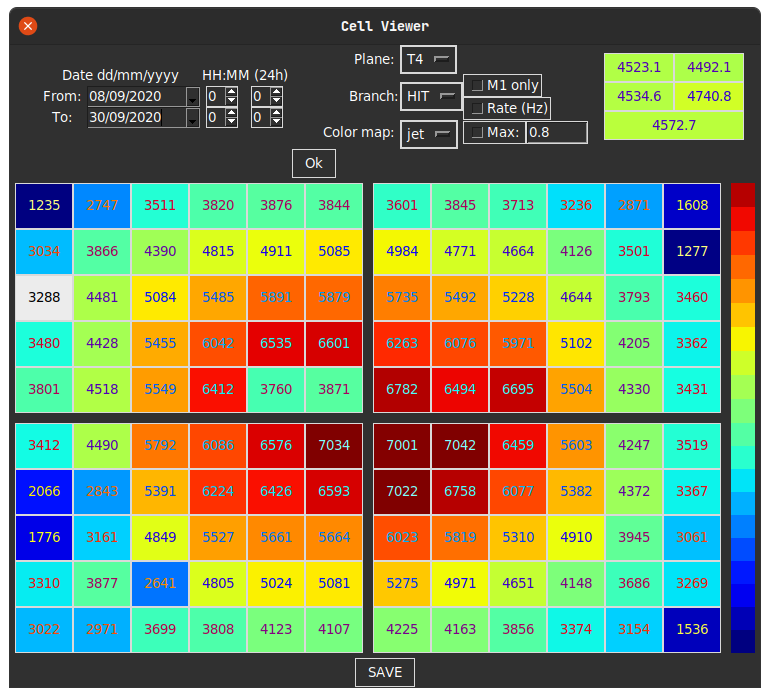

# Cell Viewer
Graphical User Interface to view stats about the TRASGO detectors easily.

Prompt                                   | GUI
:---------------------------------------:|:-----------------------------------:
 | 

## How to use
You can check ascii files (`tryydoyhhmmss.hld_cell_entries.dat`) with `ascii_cell_viewer.py` or root files (`tryydoyhhmmss.hld.root.root`). First are faster to read and you can check the mean of hits in runs (around 25 minutes each run), with standard deviation, skewness and kurtosis; instead, reading root files you can measure a more accurate rate (in Hz).

### Set working directories
First you need to create the file `utils/dirs.py` and add as UPPERCASE constants the following strings:
```python
# utils/const.py

ASCII_DATA_DIR = "/path/to/png/"
ROOT_DATA_DIR  = "/path/to/rootfiles/"
TRUFA_LIB_DIR  = "/path/to/TRUFA/"
```
where `ASCII_DATA_DIR` is the path to the directory where you have stored a copy from files in
```bash
fptrucha.usc.es:/home/labcaf/online/png/
```
`ROOT_DATA_DIR` is the path where you store unpacked files like:
```bash
tryydoyhhmmss.hld.root.root
# or
styydoyhhmmss.hld.root.root
```
and `TRUFA_LIB_DIR` is the path to the directory usually called "TRUFA", where is the compiled library `libtunpacker.so`

### Install dependencies
You need to work with:
* Python >= 3.7
* Tkinter (`pip install tk`)
* ROOT >= 6.22
* PyROOT (for Python3)

### Run the program

Finally you need to execute with Python 3
```bash
python main.py
```
and once the prompt is launched, write one of these commands:
```
HELP: (commands)
- root
Launch the GUI to read .hld.root.root files (in ROOT_DATA_DIR)
- ascii
Launch the GUI to read .dat files (in ASCII_DATA_DIR)
```
or `help <command>` to get information about such `<command>`.

### Use the Graphical User Interface

Choose date and time. Then you can choose another specifications (they are optional) and hit "Ok" button.
Each time you change something, you need to hit "Ok" again to update the map. 
When you are glad about the result, you can hit "SAVE" button to get the result in png format.
It will be saved in *store/saves/filename.png*


## Motherboard layout

### TRAGALDABAS
The motherboards are not in the same location as from the normal point 
of view, when you view TRAGALDABAS from the southwest (entering the door). 
Here are the cell layouts in both cases:

#### Motherboards on App:
The Motherboard layout shown in this GUI, is the specular image of the real layout. See **Real layout**
```
:-----:-----:
: MB3 : MB2 :
:-----:-----:
: MB4 : MB1 :
:-----:-----:
```

#### Real layout:
The LabCAF is represented below with *ASCII Art*:
```
                        FAN  _ W
       :-----:-----:   ///   | I
       : MB2 : MB3 :         | N
       :-----:-----:         | D
       : MB1 : MB4 :         | O
       :-----:-----:         | W
                             - S
                                       N   compass
         L a b C A F                    \
                                    W ---\--- E
|\                                        \
|/ DOOR                                    S


         _______________________
       //                       \
      //       M I G U E L       \
     //        C R U C E S        \
    //                             \
   //                               \
  //       mcruces.fz@gmail.com      \
  \  miguel.cruces.fernandez@usc.es //
   \_______________________________//
```
